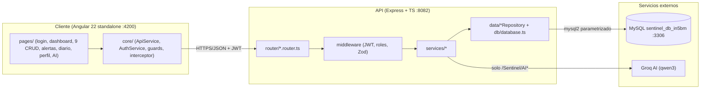

# docs/ARCHITECTURE.md — Arquitectura SENTINEL V2

## Capas del backend (`backend/src/`)

| Capa | Carpeta | Responsabilidad |
|---|---|---|
| Entrada | `index.ts`, `server/` | Arranque, helmet, CORS, rate-limit, log por request, handler central de errores |
| Rutas | `router/` | 14 routers delgados; delegan a servicios, nunca tocan SQL |
| Validación | `validation/` | Esquemas Zod + `validateWith` (400 `{ error }`, sanitiza con trim) |
| Servicios | `services/` | Lógica de negocio (`auth`, `alertas`, `diario`, `ai`, `store`) |
| Datos | `data/`, `db/` | Repositorios por entidad + `MySqlStore` / `MemoryStore` |
| Modelos | `models/` | Interfaces TypeScript (contratos API) |
| Config | `config/` | Constantes, roles, estados, validación legacy |

## Capas del frontend (`frontend/src/app/`)

| Capa | Carpeta | Responsabilidad |
|---|---|---|
| Páginas | `pages/` | 1 componente CRUD genérico (`resource/`) + pantallas propias (alertas, diario, perfil, AI, dashboard, auth, not-found) |
| Núcleo | `core/services/` | `ApiService` y `AuthService`: único punto de HTTP |
| Protección | `core/guards/`, `core/interceptors/` | `authGuard`/`adminGuard`/`staffGuard`; interceptor inyecta `Bearer` + reintento en GET |
| Config | `core/config/`, `environments/` | Constantes UI; `environment*.ts` solo con `apiUrl` |

## Flujos principales

1. **Auth**: `POST /Sentinel/Auth/register|login` → bcrypt → JWT 8h → guardado en `localStorage` (`sentinel-session`) → interceptor lo adjunta.
2. **Alerta**: ciudadano dispara (`disparar` con GPS) → estado `PENDIENTE` → staff despacha unidad (`despachos`) → ciudadano desactiva con PIN.
3. **IA**: `POST /Sentinel/AI/consultar|bienestar` → Groq (rate-limit 5/min); sin `GROQ_API_KEY` responde 502 controlado.
4. **Persistencia**: con credenciales MySQL usa tablas heredadas; sin ellas, `MemoryStore` (solo desarrollo local).
