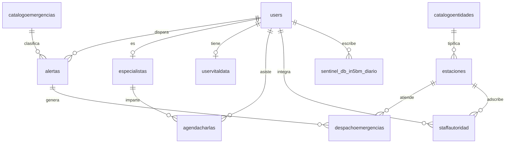

# docs/DATA_DICTIONARY.md — Modelo de datos SENTINEL

Base heredada `sentinel_db_in5bm` (utf8mb4). Fuente DDL: `backend/database/legacy/`. Nombres de tablas y columnas en español por herencia; la API expone alias en inglés (`toLegacy`/`fromLegacy` en `backend/src/db/database.ts`).

## `users` — Cuentas del sistema

| Columna | Tipo | Nulo | Clave / Default | Descripción |
|---|---|---|---|---|
| `idUsers` | int AI | No | PK | Identificador |
| `nombreUsers` | varchar(100) | No | | Nombre completo |
| `emailUsers` | varchar(255) | No | UNIQUE + índice | Correo de acceso |
| `contrasenaUsers` | varchar(255) | No | | Hash bcrypt (cost 10), jamás se expone |
| `rolUsers` | varchar(20) | Sí | CHECK `ADMIN,USER,STAFF` | Rol de autorización |
| `pinemergenciaUsers` | varchar(10) | Sí | | PIN de 4–12 dígitos para desactivar alertas |
| `fechaCreacion` | datetime | Sí | CURRENT_TIMESTAMP | Alta de la cuenta |
| `fotoUrl` | mediumtext | Sí | | Foto de perfil (URL o base64) |

## `alertas` — Alertas de emergencia

| Columna | Tipo | Nulo | Clave / Default | Descripción |
|---|---|---|---|---|
| `idAlertas` | int AI | No | PK | Identificador |
| `ciudadanoid` | int | Sí | FK → `users.idUsers` | Quien dispara |
| `emergenciaid` | int | Sí | FK → `catalogoemergencias` | Tipo de emergencia |
| `ubicacionlatAlertas` | double | Sí | | Latitud (-90 a 90) |
| `ubicacionlngAlertas` | double | Sí | | Longitud (-180 a 180) |
| `estadoAlertas` | varchar(20) | Sí | CHECK `PENDIENTE,DESPACHADA,EN_PROCESO,RESUELTA,CANCELADA` + índice | Estado del ciclo |
| `essilenciosaAlertas` | int | Sí | | 1 = pánico silencioso |
| `fechaAlertas` | datetime | Sí | CURRENT_TIMESTAMP + índice | Creación |
| `ultimaActualizacion` | datetime | Sí | auto-update | Último cambio |

## `catalogoemergencias` — Tipos de emergencia

| Columna | Tipo | Nulo | Clave | Descripción |
|---|---|---|---|---|
| `idCatalogoEmergencias` | int AI | No | PK | Identificador |
| `nombreCatalogoEmergencias` | varchar(60) | No | | Ej. Incendio, Pánico |
| `prioridadCatalogoEmergencias` | varchar(255) | No | CHECK `BAJA,MEDIA,ALTA,CRITICA` | Prioridad |

## `catalogoentidades` — Instituciones de respuesta

| Columna | Tipo | Nulo | Clave | Descripción |
|---|---|---|---|---|
| `idCatalogoEntidades` | int AI | No | PK | Identificador |
| `nombreCatalogoEntidades` | varchar(255) | No | UNIQUE | Ej. Bomberos, Policía |

## `estaciones` — Centros de mando

| Columna | Tipo | Nulo | Clave | Descripción |
|---|---|---|---|---|
| `idEstaciones` | int AI | No | PK | Identificador |
| `nombreEstaciones` | varchar(255) | No | | Nombre de la estación |
| `tipoentidadid` | int | Sí | FK → `catalogoentidades`, índice | Tipo de institución |
| `ubicacionlatEstaciones` | double | Sí | índice compuesto coords | Latitud |
| `ubicacionlngEstaciones` | double | Sí | índice compuesto coords | Longitud |
| `direccionEstaciones` | varchar(255) | Sí | | Dirección física |
| `telefonoEstaciones` | varchar(255) | Sí | | Teléfono de contacto |

## `despachoemergencias` — Unidades asignadas

| Columna | Tipo | Nulo | Clave / Default | Descripción |
|---|---|---|---|---|
| `idDespachoEmergencias` | int AI | No | PK | Identificador |
| `alertaid` | int | Sí | FK → `alertas` ON DELETE CASCADE | Alerta atendida |
| `estacionid` | int | Sí | FK → `estaciones` | Estación que responde |
| `unidadidDespachoEmergencias` | varchar(255) | Sí | | Identificador de la unidad |
| `fechahoraDespachoEmergencias` | datetime | Sí | CURRENT_TIMESTAMP | Hora del despacho |

## `especialistas` — Personal médico (PK = usuario)

| Columna | Tipo | Nulo | Clave | Descripción |
|---|---|---|---|---|
| `userid` | int | No | PK + FK → `users` ON DELETE CASCADE | Usuario especialista |
| `especialidadEspecialistas` | varchar(255) | Sí | | Especialidad |
| `biografiaEspecialistas` | text | Sí | | Trayectoria |

## `staffautoridad` — Personal de autoridad

| Columna | Tipo | Nulo | Clave | Descripción |
|---|---|---|---|---|
| `idStaffAutoridad` | int AI | No | PK | Identificador |
| `estacionid` | int | Sí | FK → `estaciones` | Estación adscrita |
| `rangoStaffAutoridad` | varchar(255) | Sí | | Rango o cargo |
| `estatusStaffAutoridad` | varchar(255) | Sí | CHECK `ACTIVO,INACTIVO,VACACIONES` | Estatus |
| `userid` | int | Sí | FK → `users` | Usuario del personal |

## `agendacharlas` — Charlas comunitarias

| Columna | Tipo | Nulo | Clave | Descripción |
|---|---|---|---|---|
| `idAgendaCharlas` | int AI | No | PK | Identificador |
| `ciudadanoid` | int | Sí | FK → `users` | Asistente |
| `especialistaid` | int | Sí | FK → `especialistas` | Expositor |
| `fechahoraAgendaCharlas` | datetime | No | | Fecha programada |
| `estadoAgendaCharlas` | varchar(255) | Sí | CHECK `PROGRAMADA,CONFIRMADA,REALIZADA,CANCELADA` | Estado |

## `uservitaldata` — Ficha médica (PK = usuario)

| Columna | Tipo | Nulo | Clave | Descripción |
|---|---|---|---|---|
| `idUser` | int | No | PK + FK → `users` ON DELETE CASCADE | Usuario |
| `gruposanguineoUser` | varchar(255) | Sí | | Grupo sanguíneo (O+, A-, …) |
| `alergiasUser` | text | Sí | | Alergias conocidas |
| `enfermedadescronicasUser` | text | Sí | | Condiciones crónicas |
| `contactoemergenciaUser` | varchar(255) | Sí | | Contacto de emergencia |

## `sentinel_db_in5bm_diario` — Diario emocional

| Columna | Tipo | Nulo | Clave / Default | Descripción |
|---|---|---|---|---|
| `id` | bigint AI | No | PK | Identificador |
| `fecha_registro` | datetime | Sí | CURRENT_TIMESTAMP | Fecha visible de la entrada |
| `contenido` | text | No | | Texto (máx. 5000) |
| `titulo` | varchar(100) | Sí | | Título (máx. 200) |
| `user_id` | int | No | FK → `users` + índice | Autor |
| `fecha_creacion` | datetime(6) | No | | Creación con microsegundos |

Nota: `backend/database/legacy/sentinel_db_in5bm_routines.sql` contiene rutinas heredadas sin uso activo por la API.
